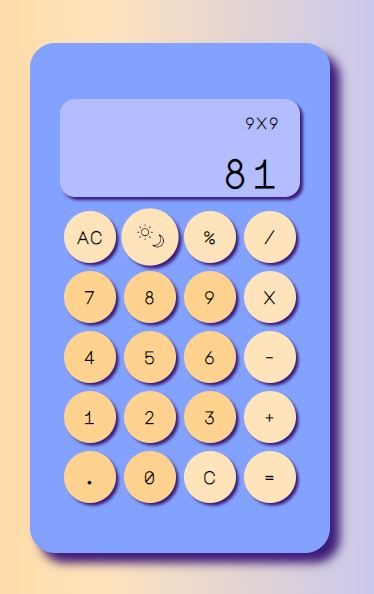
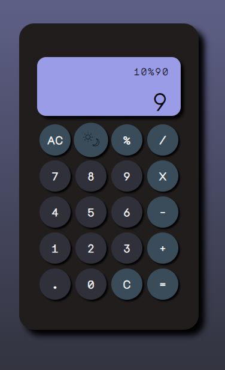
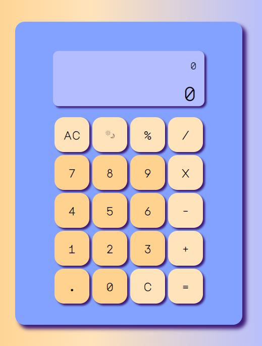

# Typescript Calculator Challenge 
### By Katarzyna Kozlowska 

## About

This repo contains the code for a simple browser based calculator. 

 *  The User Interface was made using HTML and CSS (SCSS).
 * The calculator magic is made in Typescript. 
 * The interactions on the calculator are handled using DOM.

## Functionality 

The calculator can take multiple input values, and then perform a calculation. 
The calculator will only perform the calculation once the "=" button is pressed. 

## Features: 

* Addition
* SUbtraction
* Multiplication
* Division
* Clearing the display
* Works out percentage of a number by dividing by 100 and multiplying by second number
* Toggles Dark-Mode and Light-Mode
* Responsive Design 

## Preview 
*Normal Preview:*  

*Dark Mode Preview:*  

*Tablet Preview:*  

